# FULLDocsWitharchitekture.md

# 1. DOCUMENT CONTROL

```text
Project:          Hooken — Uniswap v4 Hook-Based Token Launchpad
Document:         Master Technical Documentation & Architecture Reference
Version:          1.0
Status:           Draft — compiled from source materials; implementation not yet started in this workspace
Generated:        August 8, 2026
Primary Source:   attached_assets/PRD_1786199037500.md (Hooken PRD v1.0)
Source Documents: 1. attached_assets/PRD_1786199037500.md — Hooken Product Requirements Document v1.0
                  2. attached_assets/hockedpaper_1786199037503.txt — Hooken Protocol Technical Whitepaper v1.0
                  3. Replit workspace codebase (pnpm monorepo scaffold — see Section 36)
Known Limitations:
  - No Hooken application source code, smart contract code, or deployed frontend/backend exists
    in this workspace yet. All protocol behavior documented here derives from the PRD and whitepaper.
  - Several items are explicitly UNKNOWN (audit details, $HOOKEN supply, KPIs — see Sections 49–50).
```

**Priority of information applied:** Where PRD and whitepaper overlap, they agree; where the whitepaper provides implementation-level detail (exact percentages, windows, caps), that detail is treated as authoritative for protocol mechanics. Conflicts and gaps are recorded in Sections 49–50.

---

# 2. EXECUTIVE SUMMARY

**What it is.** Hooken is a token launchpad built natively on the Uniswap v4 Hook Framework, deployed primarily on Robinhood Chain (EVM-compatible), with planned expansion to Base and Ethereum.

**Core purpose.** Let anyone launch an ERC-20 token directly into a *real, permanent* Uniswap v4 pool in a single atomic transaction — with zero platform fees, permanently burned liquidity, and built-in anti-snipe protection.

**Main problem.** Legacy launchpads rely on bonding curves (synthetic pre-markets requiring later "graduation"), charge upfront/ongoing fees, use expirable liquidity locks, and expose launches to MEV/sniper bots in the first blocks.

**Core solution.** One atomic factory transaction: deploy token → mint 100% supply → initialize Uniswap v4 pool with the full supply as single-sided liquidity → burn 100% of the LP position to the dead address → attach the shared `HookenAntiSnipeHook` → execute optional tax-free dev buy. All differentiated behavior (dynamic fees, anti-snipe, whitelist, creator revenue streaming) lives in the hook, not a forked AMM.

**Target users.** Token creators (individuals, teams, communities), traders, and — in the future — enterprise launch customers.

**Major system components.**
- **Smart contracts (on-chain):** Hooken Factory, ERC-20 token contracts, `HookenAntiSnipeHook`, Uniswap v4 PoolManager (external), Protocol Treasury.
- **dApp frontend:** launch wizard (6 stages), trending/search/token detail pages, creator dashboard with trustless revenue claiming (https://www.hooken.app/).
- **Fallback pipeline:** Doppler Protocol Dutch auction on chains without a native Hooken factory.

**Key differentiators.** $0 launch fee, 0% protocol cut, real liquidity from block one, liquidity burned (not locked), on-chain anti-snipe (4s / 50% window), all built as a Uniswap v4 hook.

**High-level architecture.** A thin, trust-minimized dApp over on-chain contracts: the frontend orchestrates wallet signatures; all economic logic executes atomically on-chain; state of record is the blockchain.

---

# 3. PROJECT VISION & OBJECTIVES

| Category | Content | Source |
|---|---|---|
| Vision | Every token launch gets a real, permanent, protected market from its very first block. | PRD §2, §4 |
| Mission | Remove bonding curves, fees, and rug-pull vectors from token launching by building the launchpad *as* a Uniswap v4 hook. | PRD §4 |
| Strategic objectives | Be the best venue to launch and trade; monetize via premium/enterprise/routing layers, never via launch fees or creator revenue cuts. | PRD §6.1, §11.1 |
| Product objectives | Single-transaction launch; creator-owned economics (100% of trading tax); trustless anytime revenue claims; anti-snipe protection by default. | PRD §5, §6, §8 |
| Technical objectives | All differentiated logic in an attachable, versionable hook; core AMM math stays generic/battle-tested; contract-level (not UI-level) enforcement of caps. | PRD §4, §7 |
| Business objectives | Multi-chain expansion (Base, Ethereum); hook template library; native trading layer; $HOOKEN buyback-and-burn once revenue streams activate. | PRD §10, §11 |
| Success criteria | **NOT SPECIFIED** — no KPIs defined in sources (PRD §16.5). |
| Non-goals | No platform fees or protocol cut of baseline creator taxes; no liquidity locks (burn only); no bonding curve on the native path. | PRD §4, §6 |

---

# 4. PROBLEM DEFINITION

**Existing problem & current workflow (legacy launchpads):**
1. Creator deploys token on a bonding curve (synthetic/virtual liquidity).
2. Token must "graduate" later to a real AMM pool — delay + discontinuity in trading conditions.
3. Platform charges launch fees and/or takes a cut of trading revenue.
4. Liquidity is time-locked, not destroyed — locks expire, admin keys exist.
5. MEV/sniper bots front-run genuine buyers in the first blocks.
6. Multi-step flows (deploy → seed → lock → announce) add latency and approval overhead.

**Pain points:** counterparty risk, execution latency, value extraction by bots, fee leakage, rug-pull vectors.

**Existing alternatives & their limitations:** bonding-curve launchpads (see comparison, Section 12 of PRD, reproduced in Section 48 traceability): fees, virtual liquidity, graduation friction, lock-based (not burn-based) safety.

**Why Hooken is necessary / problems solved:**
- No graduation step — the launch pool *is* the permanent market.
- No fees in either direction.
- Liquidity burned at block zero — no lock to expire, no admin key.
- Anti-snipe rules enforced at the protocol (hook) level, not off-chain.
- One atomic transaction from idea to live tradable token.

---

# 5. TARGET USERS & ACTORS

| Actor | Description | Permissions | Main Actions |
|---|---|---|---|
| Token Creator | End user launching a token | Configure launch params; sign launch tx; claim own revenue | Fill identity form, set whitelist (≤20), set base tax (1–10%), optional dev buy (≤5%), launch, claim ETH revenue |
| Trader | End user buying/selling launched tokens | Trade any live pool via wallet | Discover tokens (trending/search), swap on Uniswap v4 through Hooken UI |
| Whitelisted Wallet | Address registered by creator pre-launch | Bypass anti-snipe tax in first 4 s | Trade freely from block one |
| Hooken Factory (contract) | Protocol deployment contract | Deploy tokens, init pools, burn LP, attach hook, execute dev buy | Executes the atomic launch sequence |
| `HookenAntiSnipeHook` (contract) | Shared hook attached to every pool | Intercept `beforeSwap`/`afterSwap` | Compute dynamic fees, enforce whitelist/anti-snipe, accrue & pay out creator revenue |
| Uniswap v4 PoolManager | External DEX infrastructure | Core AMM execution | Swaps, liquidity accounting, hook callbacks |
| Protocol Treasury (contract/address) | Recipient of anti-snipe penalties | Receive 50% penalty taxes | Holds bot-disincentive funds (not standard revenue) |
| MEV Bot / Sniper | Adversarial actor | None (deterred) | Attempts block-zero front-running; hit with 50% tax |
| Doppler Protocol | External fallback pipeline | Dutch auction + auto-migration | Price discovery on chains without native factory |
| Enterprise customer (future) | Planned premium user | **NOT SPECIFIED** | Premium customization, enterprise launcher tools (roadmap) |

---

# 6. PRODUCT OVERVIEW

### Feature: Atomic Token Launch
```text
Purpose:            Take a token from idea to live, tradable market in one transaction
User:               Token Creator
Input:              Name, ticker, image, description, optional socials; whitelist (≤20 addrs);
                    base tax rate (1.0–10.0%); optional dev buy (≤5.0% supply)
Processing:         Factory deploys ERC-20, mints 100% supply, initializes Uniswap v4 pool
                    (single-sided, no creator ETH seed), burns 100% LP to 0x…dEaD,
                    attaches HookenAntiSnipeHook, executes dev buy pre-public-trading
Output:             Live Uniswap v4 pool; token listed on trending/search/detail pages
Dependencies:       Uniswap v4 PoolManager on target chain; Hooken factory deployed;
                    creator wallet with gas ETH
Failure Conditions: Tx revert (gas, invalid params, dev buy >5% rejected at contract level)
```

### Feature: Creator Whitelist (Protection Settings)
```text
Purpose:            Let trusted addresses trade from block one, bypassing anti-snipe tax
User:               Token Creator (configures); Whitelisted Wallets (benefit)
Input:              Up to 20 wallet addresses, before launch tx broadcast
Processing:         Hook checks trader address against immutable whitelist during window
Output:             Whitelisted addresses trade at normal rates in first 4 seconds
Dependencies:       HookenAntiSnipeHook
Failure Conditions: Whitelist immutable post-launch — cannot fix mistakes after broadcast
```

### Feature: Dev Buy
```text
Purpose:            Creator acquires a starting position atomically, without racing bots
User:               Token Creator
Input:              Desired allocation ≤5.0% of total supply
Processing:         Executed inside the launch transaction, before public trading; tax-free;
                    cap enforced at smart-contract level
Output:             Creator holds allocation at launch
Dependencies:       Launch transaction
Failure Conditions: Allocation >5% reverts (on-chain hard cap)
```

### Feature: Dynamic Trading Tax (Base + Cycling Tiers)
```text
Purpose:            Creator revenue + fee unpredictability against static arbitrage
User:               Traders pay; Creator earns
Input:              Base rate (1.0–10.0%) chosen at launch; per-pool trade counters
Processing:         Hook computes effective rate per trade — buy cycle (4 trades):
                    Base, Base, 4.0%, 2.0%; sell cycle (6 trades):
                    Base, Base, 10.0%, 4.0%, 3.0%, 2.0%
Output:             Tax accrues in the hook in native ETH, 100% to creator
Dependencies:       beforeSwap/afterSwap callbacks
Failure Conditions: NOT SPECIFIED
```

### Feature: Anti-Snipe Window
```text
Purpose:            Make block-zero sniping unprofitable
User:               Protocol-level defense (affects non-whitelisted buyers)
Input:              Buy attempts during first 4 seconds post-launch
Processing:         Flat 50.0% tax on non-whitelisted buys during window
Output:             Penalty routed 100% to Hooken Protocol Treasury (bot disincentive,
                    not standard protocol revenue)
Dependencies:       HookenAntiSnipeHook; whitelist engine
Failure Conditions: NOT SPECIFIED (e.g., behavior at exact window boundary not defined)
```

### Feature: Revenue Claim (Creator Dashboard)
```text
Purpose:            Trustless, anytime withdrawal of accrued trading revenue
User:               Token Creator
Input:              Claim action from token dashboard
Processing:         Direct on-chain withdrawal from hook contract; no approval process,
                    no off-chain bookkeeping; no claim fee
Output:             Native ETH to creator wallet
Dependencies:       Hook accrual; creator wallet
Failure Conditions: NOT SPECIFIED
```

### Feature: Discovery (Trending / Search / Token Detail)
```text
Purpose:            Surface live tokens backed by real on-chain activity
User:               Traders
Input:              On-chain pool/trading activity
Processing:         NOT SPECIFIED (indexing mechanism not documented)
Output:             Trending lists, search results, token detail pages on hooken.app
Dependencies:       On-chain data availability
Failure Conditions: NOT SPECIFIED
```

### Feature: Doppler Fallback (non-native chains)
```text
Purpose:            Preserve feature parity on chains without the native Hooken factory
User:               Token Creator
Input:              Launch request on a non-native chain
Processing:         ETH-denominated Dutch auction price discovery → on graduation, funds
                    auto-migrate into a permanently locked, fee-autocompounding Uniswap v4 pool
Output:             Eventual real Uniswap v4 liquidity
Dependencies:       Doppler Protocol
Failure Conditions: NOT SPECIFIED. Note: fallback ends in a *locked* (not burned) pool —
                    differs from native-path guarantee (see OQ-006)
```

---

# 7. FUNCTIONAL REQUIREMENTS

| ID | Requirement | Actor | Input | Output | Priority | Dependencies |
|---|---|---|---|---|---|---|
| FR-001 | Creator can define token identity (name, ticker, image, description, optional socials) | Creator | Form data | Launch config | Must | — |
| FR-002 | Creator can whitelist up to 20 addresses pre-launch | Creator | ≤20 addresses | Immutable whitelist | Must | FR-004 |
| FR-003 | Whitelist locks at launch broadcast; not editable after | System | Launch tx | Immutable state | Must | FR-002 |
| FR-004 | Launch executes as one atomic tx: deploy ERC-20 + mint 100% supply | Factory | Signed tx | Token contract | Must | — |
| FR-005 | Full supply deposited as single-sided liquidity into new Uniswap v4 pool; no creator ETH seed | Factory | Token supply | Live pool | Must | FR-004 |
| FR-006 | 100% of LP position transferred to 0x…dEaD in the same tx | Factory | LP NFT/tokens | Burned LP | Must | FR-005 |
| FR-007 | `HookenAntiSnipeHook` attached to every pool at creation | Factory | Pool init | Hooked pool | Must | FR-005 |
| FR-008 | Optional dev buy ≤5.0% supply, atomic, pre-public, tax-free, contract-enforced cap | Creator | Allocation % | Creator position | Should | FR-004..007 |
| FR-009 | Creator selects base tax 1.0–10.0%, symmetric buy/sell baseline | Creator | Rate | Fee config | Must | FR-007 |
| FR-010 | Hook cycles effective fees: buys 4-trade cycle (Base, Base, 4%, 2%); sells 6-trade cycle (Base, Base, 10%, 4%, 3%, 2%) | Hook | Trade counters | Effective rate | Must | FR-009 |
| FR-011 | 100% of baseline trading tax accrues to creator in native ETH inside the hook | Hook | Swaps | Accrued ETH | Must | FR-010 |
| FR-012 | Creator can claim accrued revenue anytime, trustlessly, fee-free, via dashboard | Creator | Claim tx | ETH payout | Must | FR-011 |
| FR-013 | First 4 s post-launch: non-whitelisted buys taxed flat 50%, routed to Protocol Treasury | Hook | Buy during window | Penalty tax | Must | FR-007 |
| FR-014 | Whitelisted addresses bypass anti-snipe tax during window | Hook | Whitelisted swap | Normal-rate trade | Must | FR-002, FR-013 |
| FR-015 | Launched tokens appear on trending, search, and token detail pages backed by real on-chain activity | Frontend | On-chain data | Discovery UI | Must | FR-005 |
| FR-016 | $0 launch fee; 0% protocol cut; no listing/graduation/claim fees | System | — | Fee policy | Must | — |
| FR-017 | On non-native chains, launches route via Doppler: Dutch auction → auto-migration to locked, autocompounding v4 pool | System | Launch on non-native chain | Fallback launch | Should | Doppler |
| FR-018 | (Roadmap) Selectable hook template library: custom tax, vesting/transfer-restricted, liquidity-shaping hooks | Creator | Template choice | Custom pool behavior | Could | FR-007 |
| FR-019 | (Roadmap) $HOOKEN buyback-and-burn funded by future protocol revenue | System | Revenue | Burns | Could | §11 |

---

# 8. NON-FUNCTIONAL REQUIREMENTS

| ID | Category | Requirement | Source |
|---|---|---|---|
| NFR-001 | Performance | Launch flow must confirm quickly to minimize sniping window; Robinhood Chain chosen for low fees + fast confirmation | PRD §3 |
| NFR-002 | Security | No admin key over liquidity; no timelock; burn-only — zero protocol-level rug vector | PRD §8.4 |
| NFR-003 | Security | Anti-snipe and caps enforced at smart-contract level, never UI-only | PRD §8.3 |
| NFR-004 | Trust | Revenue claims trustless & self-serve — no manual approvals, no off-chain bookkeeping | PRD §5.6 |
| NFR-005 | Integrity | Whitelist immutable post-launch | PRD §5.2 |
| NFR-006 | Maintainability | Differentiated logic in versionable/replaceable hooks; core AMM untouched | PRD §4 |
| NFR-007 | Compatibility | Any EVM-compatible wallet; small ETH balance for gas is the only prerequisite | PRD §3 |
| NFR-008 | Scalability | Multi-chain expansion (Base, Ethereum) with Doppler fallback for parity | PRD §9, §10 |
| NFR-009 | Cost | Zero platform fees in either direction (gas only) | PRD §6.1 |
| NFR-010 | Availability / Reliability / Observability / DR / Rate limiting / Privacy | **NOT SPECIFIED** in source documentation | — |

---

# 9. SYSTEM BOUNDARY

### Inside the system
- Hooken dApp frontend (hooken.app): launch wizard, discovery pages, creator dashboard
- Hooken Factory contract
- Hooken-deployed ERC-20 token contracts
- `HookenAntiSnipeHook` contract
- Hooken Protocol Treasury (anti-snipe penalty recipient)
- Docs site (hooken.app/docs)
- Any backend/indexing supporting trending/search: **implied but NOT SPECIFIED**

### Outside the system
- Uniswap v4 PoolManager / Hook Framework (external protocol dependency)
- Robinhood Chain, Base, Ethereum (blockchain networks)
- EVM wallets (user-provided)
- Doppler Protocol (fallback pipeline)
- X/Twitter (@hookendotapp) — social presence only

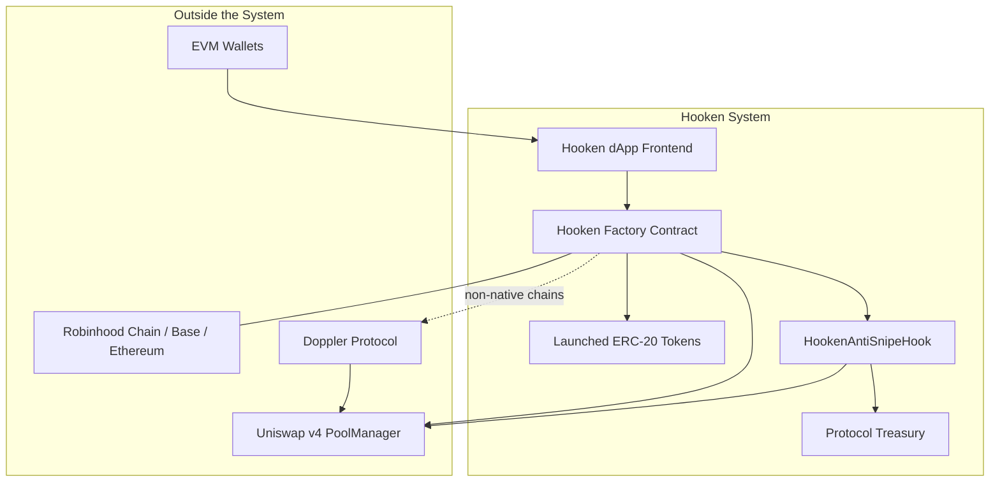

---

# 10. HIGH-LEVEL SYSTEM ARCHITECTURE

Hooken is an **on-chain-first architecture**: all economic and security logic executes in smart contracts; the frontend is an orchestration and discovery layer.

- **Frontend:** launch wizard (6 stages), trending/search/token detail, creator dashboard with claim. Framework/stack: **NOT SPECIFIED**.
- **API / backend layer:** **NOT SPECIFIED** — trending/search imply some indexing, mechanism undocumented.
- **Business logic:** entirely in the Factory (launch sequence) and Hook (fees, anti-snipe, whitelist, revenue).
- **Database / cache / queue / workers:** **NOT SPECIFIED**.
- **Blockchain:** Robinhood Chain primary; Base & Ethereum planned; Doppler fallback elsewhere.
- **Authentication:** wallet-based (transaction signatures). No account system documented.
- **Monitoring:** **NOT SPECIFIED**.

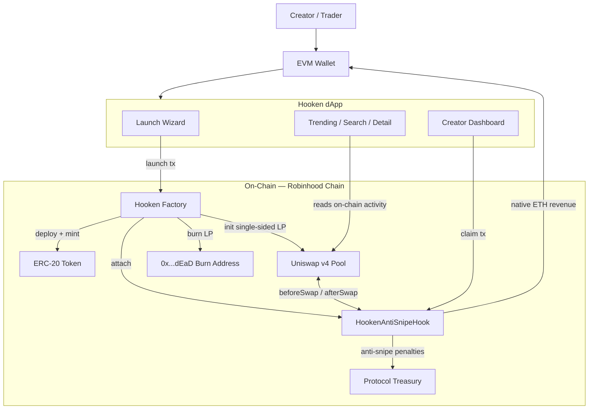

---

# 11. ARCHITECTURE LAYERS

| Layer | Responsibility | Components | Dependencies | Inputs | Outputs | Security boundary |
|---|---|---|---|---|---|---|
| Presentation | Launch UX, discovery, dashboard | hooken.app dApp | Wallet providers, chain RPC | User actions | Signed transactions, reads | Untrusted client; contracts must not trust it |
| Wallet/Signing | Key custody, tx signing | User EVM wallets | Chain RPC | Tx requests | Signed txs | User-controlled; outside Hooken |
| Protocol (Domain) | Launch sequence, fees, anti-snipe, whitelist, revenue | Factory, Hook, ERC-20s, Treasury | Uniswap v4 PoolManager | Signed txs, swap callbacks | State changes, events, ETH payouts | Trust anchor — all enforcement here |
| AMM Infrastructure | Swap execution, liquidity accounting | Uniswap v4 PoolManager | Chain | Swaps | Pool state, hook callbacks | External, battle-tested, unmodified |
| Chain | Consensus, finality | Robinhood Chain / Base / Ethereum | — | Txs | Blocks | Network security assumptions |
| Fallback Integration | Launch parity on non-native chains | Doppler pipeline | Doppler Protocol | Launch requests | Auctioned + migrated pools | External protocol trust |

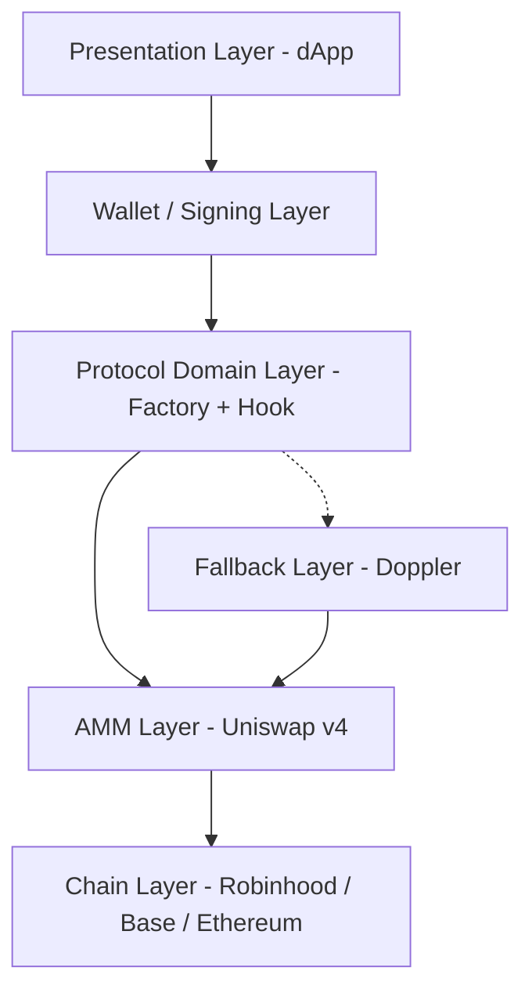

---

# 12. COMPONENT ARCHITECTURE

### Component: Hooken Factory
```text
Purpose:          Atomic launch orchestration
Responsibilities: Deploy ERC-20 + mint supply; init v4 pool single-sided; burn LP to dead
                  address; attach hook; execute dev buy pre-public
Technology:       Solidity smart contract (implied by EVM/Uniswap v4; exact details NOT SPECIFIED)
Inputs:           Launch parameters (identity, whitelist, base tax, dev buy) in one signed tx
Outputs:          Token contract, hooked pool, burned LP, dev allocation
Dependencies:     Uniswap v4 PoolManager, HookenAntiSnipeHook
State:            NOT SPECIFIED (per-launch registry implied)
Failure Modes:    Tx revert (invalid params, >5% dev buy)
Security:         Cap enforcement on-chain; no admin key over resulting liquidity
Scaling:          One deployment per chain; Doppler fallback elsewhere
```

### Component: HookenAntiSnipeHook (shared hook)
```text
Purpose:          All differentiated pool behavior
Responsibilities: Intercept beforeSwap/afterSwap; compute dynamic fees (base + cycling);
                  enforce whitelist + 4s/50% anti-snipe; accrue creator revenue in native ETH;
                  route penalties to Treasury; pay out claims
Technology:       Uniswap v4 hook contract (Solidity implied)
Inputs:           Swap callbacks, pool config (base rate, whitelist, launch timestamp), claims
Outputs:          Effective fee per trade, accrued balances, ETH payouts, penalty routing
Dependencies:     Uniswap v4 PoolManager callbacks
State:            Per-pool trade counters (buy: mod 4, sell: mod 6), whitelists, launch
                  timestamps, creator revenue balances
Failure Modes:    NOT SPECIFIED
Security:         Whitepaper describes it as "audited" — audit firm/report/date UNKNOWN (OQ-003)
Scaling:          Single shared contract bound to every native-factory pool; roadmap:
                  template library replaces single-hook model
```

### Component: Launched ERC-20 Token
```text
Purpose:          The creator's asset
Responsibilities: Standard ERC-20; fixed total supply minted 100% at deployment
Technology:       ERC-20 (Solidity implied)
Inputs/Outputs:   Transfers, approvals
Dependencies:     Deployed by factory
State:            Balances, fixed supply
Failure Modes:    Standard ERC-20 failure modes
Security:         Full supply committed to burned-LP pool at birth
Scaling:          One contract per launch
```

### Component: Hooken dApp Frontend
```text
Purpose:          Launch wizard, discovery, creator dashboard
Responsibilities: Collect launch params; request wallet signature; display trending/search/
                  detail from real on-chain activity; expose claim
Technology:       NOT SPECIFIED
Inputs:           User input, on-chain data
Outputs:          Transactions to sign, rendered market data
Dependencies:     Wallets, chain RPC, contracts
State:            NOT SPECIFIED
Failure Modes:    NOT SPECIFIED
Security:         Untrusted; all invariants enforced on-chain
```

### Component: Protocol Treasury
```text
Purpose:          Receive 100% of anti-snipe penalty taxes
Responsibilities: Hold bot-disincentive funds (explicitly not standard protocol revenue)
Technology/State/Failure/Scaling: NOT SPECIFIED
```

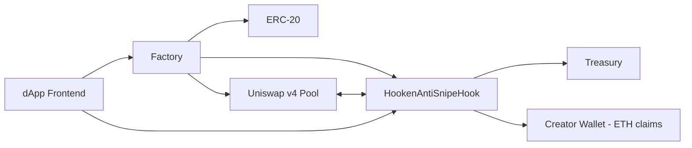

---

# 13. FRONTEND ARCHITECTURE

Documented capabilities (framework, routing, and state management are **NOT SPECIFIED** in sources):

| Area | Documented behavior |
|---|---|
| Pages | Launch wizard (Stages 1–6), trending, search, token detail, creator dashboard, docs |
| Launch wizard | Stage 1 Identity → Stage 2 Protection/Whitelist → Stage 3 Dev Buy → Stage 4 Launch (single signature) → Stage 5 Trade → Stage 6 Claim |
| Wallet integration | Any EVM-compatible wallet; needs small ETH for gas |
| API communication | Reads real on-chain activity for trending/search/detail (mechanism NOT SPECIFIED) |
| Authentication | Wallet signature; no account system documented |
| Form handling / error handling / loading / caching / responsive | NOT SPECIFIED |

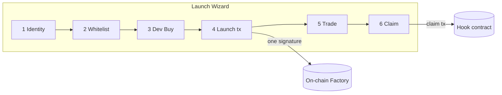

---

# 14. BACKEND ARCHITECTURE

**NOT SPECIFIED.** The source materials document no off-chain backend. The stated design goal is the opposite: "no off-chain infrastructure, no manual intervention" for fee collection, anti-snipe, and whitelist enforcement (PRD §2.3), and "no off-chain bookkeeping" for claims (PRD §5.6).

An indexing/aggregation capability is *implied* by trending and search pages but is undocumented (OQ-007). The "backend" in practice is the smart-contract layer, documented in Sections 22–23.

Request flow (contract-as-backend):

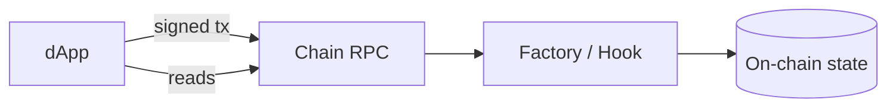

---

# 15. API ARCHITECTURE

**No HTTP/REST/GraphQL APIs are specified in the source documentation.** The public "API" of the system is the smart-contract interface. Documented contract-level operations:

| Operation | "Endpoint" (contract) | Purpose | Auth | Input | Output | Errors |
|---|---|---|---|---|---|---|
| Launch | Factory (function name NOT SPECIFIED) | Atomic deploy+pool+burn+hook+dev buy | Creator signature | Identity, whitelist ≤20, base tax 1–10%, dev buy ≤5% | Live hooked pool | Revert on invalid params / >5% dev buy |
| Swap | Uniswap v4 PoolManager → hook `beforeSwap`/`afterSwap` | Trade with dynamic fees | Trader signature | Swap params | Executed swap, fee accrual | Revert per AMM rules |
| Claim | Hook (function name NOT SPECIFIED) | Withdraw creator revenue | Creator signature | Claim call | Native ETH transfer | NOT SPECIFIED |

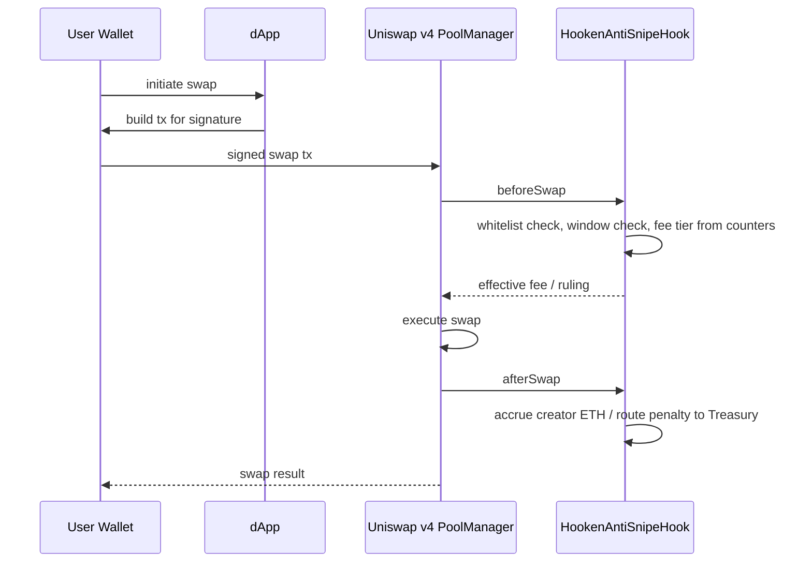

If the frontend uses an off-chain API for discovery, it is **UNKNOWN — requires confirmation**.

---

# 16. DATABASE ARCHITECTURE

**No off-chain database is specified.** The system of record is on-chain contract state. Documented on-chain entities:

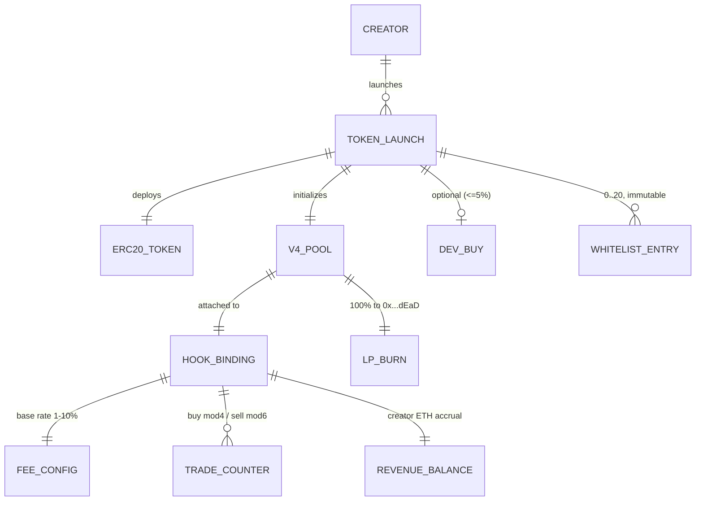

Entity fields beyond those named in the sources: **UNKNOWN / NOT SPECIFIED**. Indexes, constraints, and transactions are the EVM's (atomicity of the launch call is the key transactional guarantee). Any indexing DB behind trending/search: **NOT SPECIFIED**.

---

# 17. DATA FLOW ARCHITECTURE

### User Request Flow (launch)

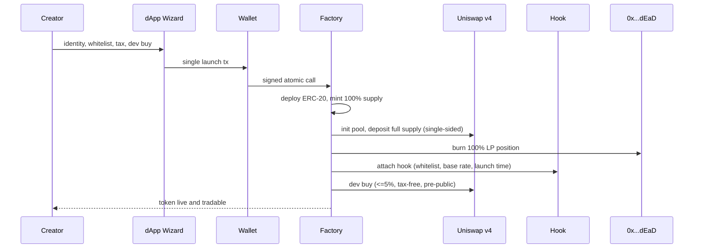

### Data Processing Flow (trade → creator revenue)

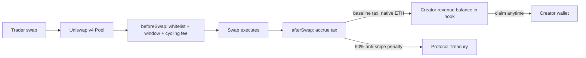

---

# 18. USER JOURNEYS

### Journey 1 — Creator launches a token
```text
Trigger:   Creator wants to launch
Action:    Completes wizard stages 1–3 (identity, whitelist, dev buy)
Validation: UI + contract-level (dev buy <=5%, whitelist <=20, tax 1–10%)
Processing: Signs ONE transaction; factory executes atomic sequence
External:  Uniswap v4 pool created; LP burned; hook attached
State:     Token live; whitelist frozen; dev allocation held
Response:  Token appears on trending/search/detail; immediately tradable
```

### Journey 2 — Trader buys at launch
```text
Trigger:   Token goes live
Action:    Trader submits buy
Validation: Hook checks whitelist + 4s window
Processing: Non-whitelisted within 4s → 50% tax to Treasury;
           otherwise cycling fee schedule applies
State:     Pool balances update; counters advance; creator revenue accrues
Response:  Swap confirmed
```

### Journey 3 — Creator claims revenue
```text
Trigger:   Any time after trading begins
Action:    Claim from token dashboard
Validation: On-chain (creator entitlement)
Processing: Trustless withdrawal from hook, no fee, no approval
State:     Revenue balance zeroed/reduced
Response:  Native ETH in creator wallet
```

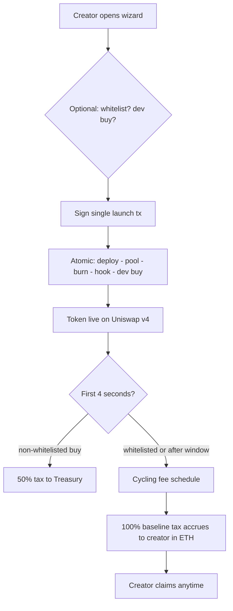

---

# 19. CORE BUSINESS LOGIC

```text
BR-001  Rule: Zero platform fees
        Condition: Any standard launch or claim
        Action: Charge $0 launch fee, 0% protocol cut, no listing/graduation/claim fee
        Result: Creator keeps 100% of baseline trading tax
        Exceptions: Anti-snipe penalties go to Treasury (bot disincentive, not revenue)

BR-002  Rule: Liquidity is burned, never locked
        Condition: Every native-path launch
        Action: 100% of LP position transferred to 0x...dEaD in launch tx
        Result: No admin key, no timelock, no rug vector
        Exceptions: Doppler fallback path produces a permanently LOCKED
                    autocompounding pool instead (whitepaper §5)

BR-003  Rule: Base tax bounds
        Condition: Launch configuration
        Action: Accept base rate only within 1.0%–10.0%
        Result: Symmetric baseline buy/sell tax
        Exceptions: Cycling tiers override on specific trade numbers (BR-004)

BR-004  Rule: Cycling fee tiers
        Condition: Each swap, per pool trade counters
        Action: Buys — 4-trade cycle: Base, Base, 4.0%, 2.0%.
                Sells — 6-trade cycle: Base, Base, 10.0%, 4.0%, 3.0%, 2.0%
        Result: Fee unpredictability vs static arbitrage
        Exceptions: NOT SPECIFIED (interaction with anti-snipe window not defined)

BR-005  Rule: Anti-snipe window
        Condition: Buy within first 4 seconds post-launch AND buyer not whitelisted
        Action: Flat 50.0% tax, 100% routed to Protocol Treasury
        Result: Sniping made materially unprofitable
        Exceptions: Whitelisted addresses (<=20) trade at normal conditions

BR-006  Rule: Dev buy cap
        Condition: Creator configures dev buy
        Action: Enforce <=5.0% of total supply at contract level; execute atomically
                pre-public; tax-free
        Result: Creator position without racing bots
        Exceptions: None documented

BR-007  Rule: Whitelist immutability
        Condition: Launch tx broadcast
        Action: Freeze whitelist permanently
        Result: No post-launch tampering
        Exceptions: None
```

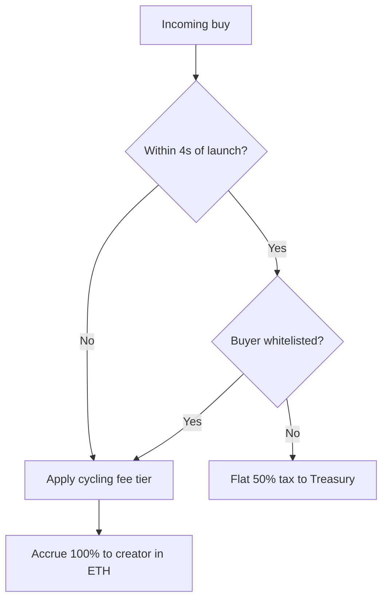

---

# 20. AUTHENTICATION & AUTHORIZATION

- **Mechanism:** Wallet-based. Users authenticate by signing transactions with any EVM-compatible wallet. No sessions, tokens, passwords, or account system are documented.
- **Authorization:** Enforced on-chain — only the creator can claim their revenue; only whitelisted addresses bypass anti-snipe; the dev buy belongs to the launching creator.
- **Admin access:** Deliberately absent for liquidity (no admin key). Any other admin surface: **NOT SPECIFIED**.
- **API keys / service auth:** NOT SPECIFIED (no off-chain services documented).

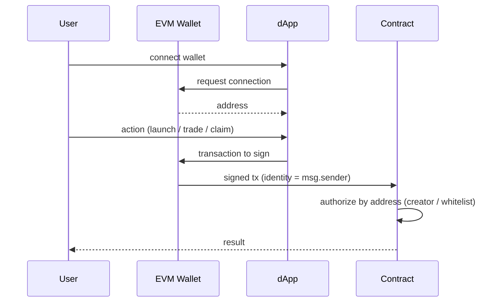

### Role / permission matrix

| Role | Launch token | Configure whitelist/tax/dev buy | Trade | Bypass anti-snipe (first 4s) | Claim revenue | Pull liquidity |
|---|---|---|---|---|---|---|
| Creator | Yes | Yes (pre-launch only) | Yes | Only if self-whitelisted (NOT SPECIFIED) | Yes (own token) | No — nobody can |
| Whitelisted wallet | — | — | Yes | Yes | No | No |
| Trader | — | — | Yes | No | No | No |
| Hooken team | — | — | — | — | — | No (no admin key) |

---

# 21. SECURITY ARCHITECTURE

| Concern | Mechanism | Source |
|---|---|---|
| Rug pull / liquidity theft | 100% LP burned to dead address at block 0; no admin key, no timelock | PRD §8.4 |
| Sniping / MEV front-running | 4-second window, flat 50% tax on non-whitelisted buys, penalty → Treasury | PRD §8.1 |
| Over-allocation exploit | Dev buy hard-capped 5% at contract level (not UI) | PRD §8.3 |
| Whitelist tampering | Immutable after launch broadcast | PRD §8.2 |
| Static fee arbitrage | Dynamic cycling fee tiers | PRD §6.3 |
| AMM correctness | Core Uniswap v4 math unmodified; custom logic isolated in hook | PRD §7.3 |
| Contract audit | Whitepaper claims hook is "audited"; firm/report/date **UNKNOWN** (OQ-003) | WP §1 |
| Input validation, rate limiting, secrets mgmt, logging security | NOT SPECIFIED | — |

Security boundaries: (1) untrusted frontend vs trusted contracts; (2) Hooken contracts vs external Uniswap v4; (3) user wallet custody vs everything else.

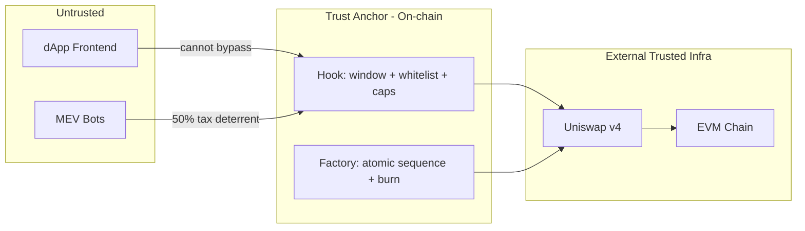

---

# 22. BLOCKCHAIN ARCHITECTURE

- **Networks:** Robinhood Chain (primary, chosen for low fees/fast confirmation); Base & Ethereum planned; other EVM chains via Doppler fallback.
- **Contracts:** Hooken Factory, per-token ERC-20s, `HookenAntiSnipeHook`, Treasury; external: Uniswap v4 PoolManager, Doppler.
- **Wallets:** any EVM wallet with gas ETH.
- **Transactions:** the defining pattern is the *single atomic launch call*; then standard swap and claim txs.
- **RPC / indexing / event listeners:** NOT SPECIFIED.
- **Gas handling:** paid by users; gas is the only launch cost.

### On-chain / Off-chain architecture
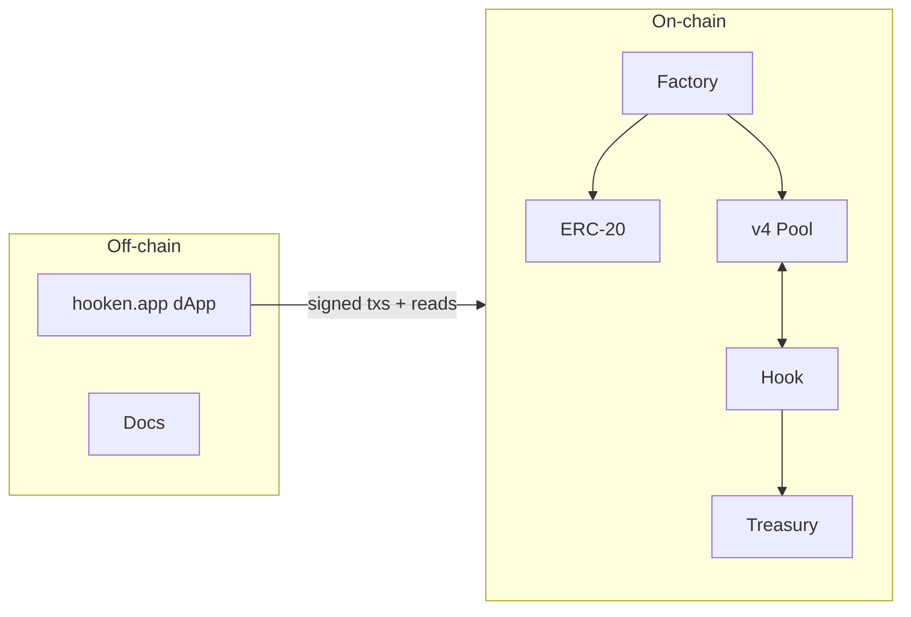

### Transaction flow (launch)
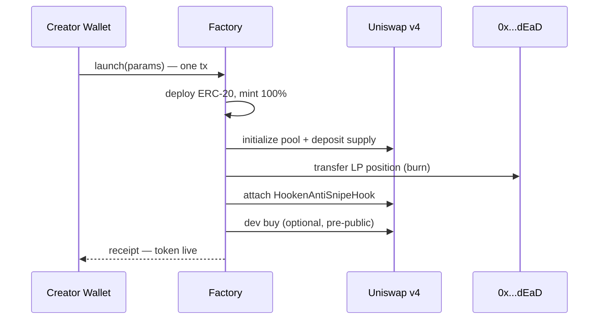

### Smart contract interaction / Event flow
Event names/signatures: **NOT SPECIFIED** — see Section 23 diagram for interactions; discovery pages read "real on-chain activity" (mechanism undocumented).

---

# 23. SMART CONTRACT ARCHITECTURE

| Contract | Responsibilities | Known functions/callbacks | State | Access control |
|---|---|---|---|---|
| Hooken Factory | Atomic launch: deploy, mint, pool init, LP burn, hook attach, dev buy | Function names NOT SPECIFIED | Launch registry implied, NOT SPECIFIED | Anyone may launch (permissionless implied) |
| HookenAntiSnipeHook | Dynamic fees, anti-snipe, whitelist, revenue accrual/claims, penalty routing | `beforeSwap`, `afterSwap` (Uniswap v4 callbacks); claim function NOT SPECIFIED | Trade counters, whitelists, launch timestamps, ETH balances per creator | Creator-only claims; whitelist immutable |
| Launched ERC-20 | Standard token, fixed supply | ERC-20 standard | Balances | Standard |
| Treasury | Receive anti-snipe penalties | NOT SPECIFIED | ETH balance | NOT SPECIFIED |

Security assumptions: Uniswap v4 PoolManager is correct; burn address is unspendable; hook "audited" (**unverified**, OQ-003). Never-invented items: no upgrade mechanism, pause switch, or ownership functions are documented — treat as NOT SPECIFIED, not as absent-by-design (except liquidity admin keys, which are explicitly absent).

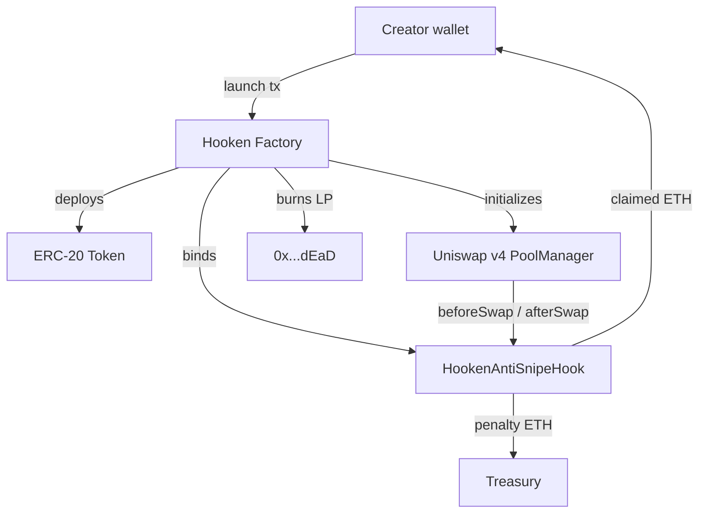

---

# 24. AI / AGENT ARCHITECTURE

**Not applicable.** No AI or agent functionality exists in the Hooken product per source documentation.

---

# 25. EXTERNAL INTEGRATIONS

| Service | Purpose | Protocol/API | Authentication | Input | Output | Failure Mode |
|---|---|---|---|---|---|---|
| Uniswap v4 PoolManager | Core AMM + hook framework | On-chain contract calls / hook callbacks | None (permissionless) | Pool init, swaps | Pool state, callbacks | Tx revert; NOT SPECIFIED further |
| Robinhood Chain (+ Base, Ethereum planned) | Execution & settlement | EVM / JSON-RPC | Tx signatures | Signed txs | Confirmed blocks | Network congestion/outage — handling NOT SPECIFIED |
| EVM Wallet providers | Key custody & signing | Wallet standards (specifics NOT SPECIFIED) | User keys | Tx requests | Signatures | User rejection; wallet unavailable |
| Doppler Protocol | Fallback launches on non-native chains | On-chain (Dutch auction + migration) | NOT SPECIFIED | Launch request | Locked autocompounding v4 pool post-graduation | NOT SPECIFIED |
| X (@hookendotapp) | Social presence | n/a | n/a | n/a | n/a | n/a |

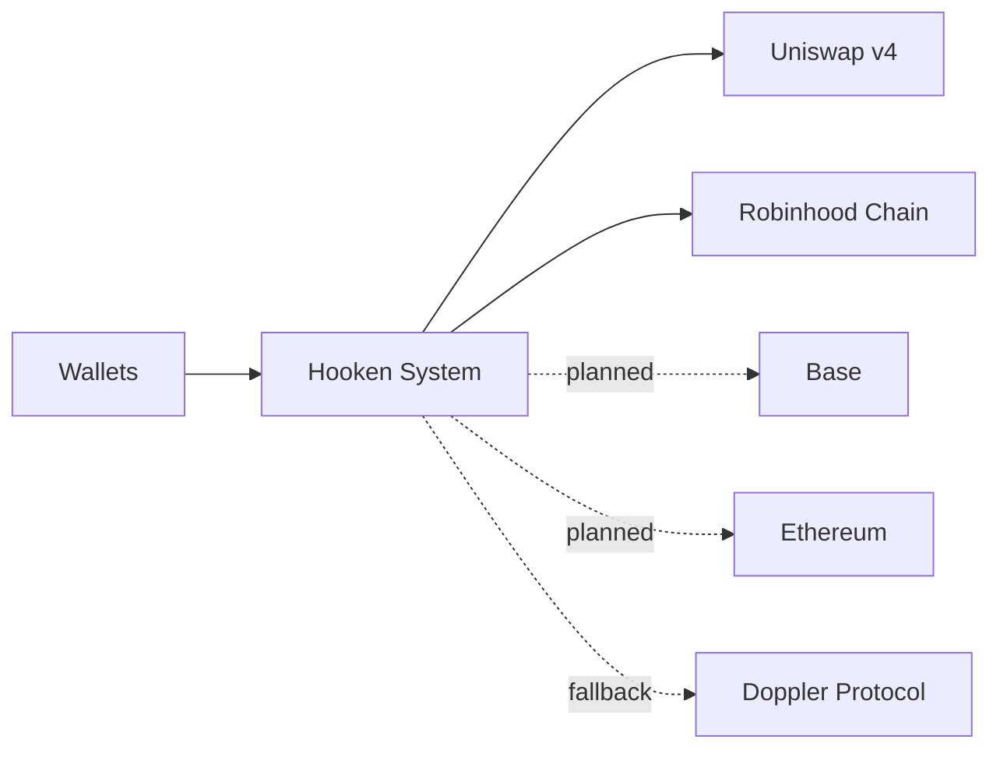

---

# 26. EVENT-DRIVEN ARCHITECTURE

No off-chain queues, workers, or webhooks are documented. The only event-like mechanism is on-chain: Uniswap v4 lifecycle checkpoints (before/after pool creation, swaps, liquidity changes) consumed synchronously by the hook.

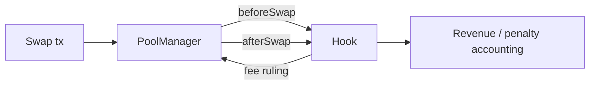

Retry, dead-letter, idempotency, ordering: governed by EVM transaction semantics; nothing additional specified.

---

# 27. BACKGROUND JOBS & WORKERS

**None documented.** The design explicitly avoids off-chain infrastructure for core mechanics. If trending/search require an off-chain indexer, its worker architecture is **UNKNOWN — requires confirmation** (OQ-007).

---

# 28. STORAGE ARCHITECTURE

| Store | Data | Why |
|---|---|---|
| On-chain contract state | Token supplies/balances, pool state, whitelists, trade counters, launch timestamps, creator revenue balances (native ETH), Treasury balance | Trustlessness — source of truth |
| Burn address 0x…dEaD | 100% of every LP position | Permanent, irrevocable liquidity commitment |
| Token image / metadata storage | Creator-provided image & description | Storage location **NOT SPECIFIED** (OQ-008) |
| Off-chain DB / cache / CDN / backups | — | NOT SPECIFIED |

---

# 29. CACHING STRATEGY

**NOT SPECIFIED.** No caching layer is documented.

---

# 30. OBSERVABILITY

**NOT SPECIFIED.** No logging, metrics, tracing, alerting, health checks, or audit-log requirements appear in the source documents. On-chain transactions and pool activity are inherently publicly observable; token pages are "backed by real on-chain activity."

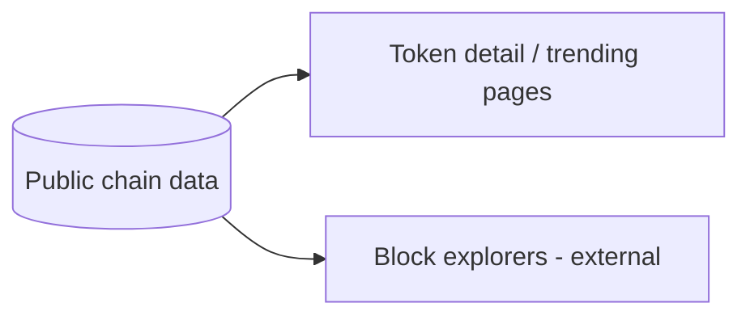

---

# 31. ERROR HANDLING

| Error class | Documented behavior |
|---|---|
| Validation (dev buy >5%) | Reverts — enforced at contract level, not just UI |
| Validation (base tax outside 1–10%, whitelist >20) | Constraint documented; exact revert behavior NOT SPECIFIED |
| Anti-snipe violation | Not an error — buy proceeds with 50% tax |
| Whitelist edit post-launch | Impossible by design (immutable) |
| Auth errors | Wrong signer simply cannot claim/act (on-chain authz) |
| Network / RPC / frontend errors | NOT SPECIFIED |

```mermaid
flowchart TD
    TX[Transaction submitted] --> V{Contract validation}
    V -->|invalid params| REVERT[Revert - no state change]
    V -->|valid| EXEC[Atomic execution]
    EXEC -->|any step fails| REVERT
    EXEC -->|all steps succeed| DONE[State committed]
```

The atomicity of the launch call is the primary error-handling guarantee: partial launches cannot exist.

---

# 32. FAILURE & RECOVERY ARCHITECTURE

- **Failure points:** launch tx revert; chain congestion widening the effective sniping window; external dependencies (Uniswap v4, Doppler).
- **Retry strategy:** user resubmits transactions; nothing automated documented.
- **Fallbacks:** Doppler pipeline when no native factory exists on a chain.
- **Recovery / consistency:** EVM atomicity — a failed launch leaves no partial state. Burned liquidity is intentionally unrecoverable (a feature, not a failure).
- **Disaster recovery:** NOT SPECIFIED.

```mermaid
flowchart TD
    L[Launch request] --> N{Native factory on chain?}
    N -->|Yes| A[Atomic native launch]
    N -->|No| D[Doppler Dutch auction] --> G[Graduation] --> M[Auto-migrate to locked autocompounding v4 pool]
    A -->|revert| R[No state change - user retries]
```

---

# 33. SCALABILITY ARCHITECTURE

- **Horizontal (chains):** deploy the factory to additional EVM chains (Base, Ethereum next); Doppler covers the gap meanwhile.
- **Per-chain throughput:** bounded by chain throughput; Robinhood Chain selected for speed/low fees (NFR-001).
- **Contract scaling:** single shared hook serves all pools today; roadmap moves to a hook template library (per-pool selectable mechanics) and a native trading layer to concentrate volume.
- **Frontend/API/DB scaling:** NOT SPECIFIED.
- **Numeric targets:** Not specified in source documentation.

---

# 34. DEPLOYMENT ARCHITECTURE

Production dApp exists at https://www.hooken.app/ with docs at /docs. Hosting, environments, CI/CD, containers, build process, rollback: **NOT SPECIFIED**.

Contract deployment model (from sources): factory + shared hook deployed per supported chain; per-token contracts deployed at launch time by the factory.

```mermaid
flowchart TB
    DEV[Development - NOT SPECIFIED] --> PROD[Production]
    subgraph PROD[Production]
        WEB[hooken.app dApp + docs]
        subgraph RHC[Robinhood Chain]
            F1[Factory] --- H1[Shared Hook]
        end
        subgraph FUT[Base / Ethereum - planned]
            F2[Factory] --- H2[Hook]
        end
    end
    WEB --> RHC
    WEB -.-> FUT
```

**This workspace:** contains only the pnpm monorepo scaffold (shared Express API server, mockup sandbox, codegen libs). No Hooken code is deployed or deployable from here yet.

---

# 35. ENVIRONMENT CONFIGURATION

No environment variables are specified in the Hooken source documents.

Workspace-level (current repo scaffold, not Hooken product config):

| Variable | Purpose | Required | Environment | Secret |
|---|---|---|---|---|
| SESSION_SECRET | Session signing for the scaffold API server | Scaffold-dependent | Development | Yes |
| DATABASE_URL | Postgres connection for the scaffold DB lib | When DB used | Development | Yes |

Hooken production configuration (RPC URLs, contract addresses, etc.): **UNKNOWN — requires confirmation**.

---

# 36. REPOSITORY / CODEBASE STRUCTURE

Actual current workspace (verified):

```text
/
├── artifacts/
│   ├── api-server/          # Shared Express 5 API server scaffold (health route only)
│   └── mockup-sandbox/      # Canvas/mockup preview environment (shadcn UI components)
├── lib/
│   ├── api-spec/            # OpenAPI spec (openapi.yaml) + Orval codegen config
│   ├── api-client-react/    # Generated React Query client
│   ├── api-zod/             # Generated Zod schemas
│   └── db/                  # Drizzle ORM + Postgres scaffold (empty schema)
├── scripts/                 # Utility scripts package
├── attached_assets/
│   ├── PRD_1786199037500.md                 # Hooken PRD (source of truth)
│   ├── hockedpaper_1786199037503.txt        # Hooken technical whitepaper
│   └── Pasted--FULL-PROJECT-DOCUMENTATION…  # This documentation task brief
├── FULLDocsWitharchitekture.md              # THIS DOCUMENT
├── replit.md                # Workspace conventions
└── pnpm-workspace.yaml, tsconfig*.json, package.json
```

### DOCUMENTATION ↔ CODEBASE DISCREPANCIES

| # | Documentation says | Codebase shows | Assessment |
|---|---|---|---|
| 1 | Live dApp at hooken.app with launch wizard, trending, dashboard | No frontend application code in this workspace | The production dApp lives elsewhere (or is not yet built); this workspace holds only a generic scaffold |
| 2 | Smart contracts (Factory, Hook, ERC-20s) | No Solidity/contract code present | Contract sources are not in this repository |
| 3 | Whitepaper: hook is "audited" | No audit report or reference in workspace | Unverifiable — OQ-003 |

---

# 37. TECHNOLOGY STACK

| Layer | Technology | Purpose | Version |
|---|---|---|---|
| Blockchain (primary) | Robinhood Chain (EVM) | Execution & settlement | NOT SPECIFIED |
| Blockchain (planned) | Base, Ethereum | Expansion | NOT SPECIFIED |
| DEX infrastructure | Uniswap v4 Hook Framework | AMM + hook callbacks | v4 |
| Smart contracts | EVM contracts (Solidity implied, NOT SPECIFIED) | Factory, hook, tokens | NOT SPECIFIED |
| Fallback | Doppler Protocol | Dutch auction + migration | NOT SPECIFIED |
| Frontend | NOT SPECIFIED | hooken.app dApp | — |
| Backend / DB / cache / monitoring / CI-CD | NOT SPECIFIED | — | — |
| Native token | $HOOKEN (unlaunched) | Buyback-and-burn value accrual | NOT SPECIFIED |
| This workspace scaffold | pnpm, TypeScript 5.9, Node 24, Express 5, Drizzle/Postgres, Orval, Zod | Future implementation base (not yet Hooken-specific) | per repo |

---

# 38. DEPENDENCY ARCHITECTURE

```mermaid
flowchart TD
    DAPP[dApp Frontend] --> WALLETS[EVM Wallets]
    DAPP --> FACTORY[Hooken Factory]
    DAPP --> HOOK[HookenAntiSnipeHook]
    FACTORY --> UNI[Uniswap v4 PoolManager]
    FACTORY --> HOOK
    HOOK --> UNI
    FACTORY --> ERC20[Launched Tokens]
    HOOK --> TREASURY[Treasury]
    FACTORY -.non-native chains.-> DOPPLER[Doppler Protocol]
    DOPPLER --> UNI
    UNI --> CHAIN[EVM Chains]
```

Critical dependency: **Uniswap v4** — the entire product is built on its hook primitive. Second-order: chain availability/performance; Doppler for non-native chains.

---

# 39. SEQUENCE DIAGRAMS

### 1. User → Frontend → Chain (general)
```mermaid
sequenceDiagram
    participant U as User
    participant FE as dApp
    participant W as Wallet
    participant SC as Contracts
    U->>FE: action
    FE->>W: tx request
    W->>SC: signed tx
    SC-->>FE: state/events
    FE-->>U: result
```

### 2. Authentication (wallet connect)
See Section 20 diagram.

### 3. Main product workflow (atomic launch)
See Section 17 "User Request Flow".

### 4. Swap with dynamic fees (contract "database" interaction)
See Section 15 diagram.

### 5. Revenue claim
```mermaid
sequenceDiagram
    participant C as Creator
    participant D as Dashboard
    participant H as Hook
    C->>D: open token dashboard
    D->>H: read accrued ETH
    C->>H: claim tx (signed)
    H->>H: verify creator, zero balance
    H-->>C: transfer native ETH
```

### 6. Doppler fallback launch
```mermaid
sequenceDiagram
    participant C as Creator
    participant HK as Hooken
    participant DP as Doppler
    participant PM as Uniswap v4
    C->>HK: launch on non-native chain
    HK->>DP: route to fallback pipeline
    DP->>DP: ETH Dutch auction price discovery
    DP->>PM: on graduation, migrate funds
    PM-->>C: permanently locked, autocompounding v4 pool
```

(AI/agent and background-worker sequences: not applicable.)

---

# 40. STATE MACHINES

### Token launch lifecycle (native path)
```mermaid
stateDiagram-v2
    [*] --> Configuring : creator opens wizard
    Configuring --> Broadcast : sign single launch tx
    Broadcast --> Live : atomic tx confirms (deploy+pool+burn+hook+devbuy)
    Broadcast --> Configuring : tx reverts (retry)
    Live --> AntiSnipeWindow : first 4 seconds
    AntiSnipeWindow --> OpenTrading : window elapses
    OpenTrading --> OpenTrading : trading forever (liquidity burned)
```

### Doppler fallback lifecycle
```mermaid
stateDiagram-v2
    [*] --> DutchAuction : launch on non-native chain
    DutchAuction --> Graduated : price discovery completes
    Graduated --> LockedPool : auto-migration to locked autocompounding v4 pool
    LockedPool --> LockedPool : permanent
```

### Creator revenue lifecycle
```mermaid
stateDiagram-v2
    [*] --> Accruing : trades generate tax in hook (native ETH)
    Accruing --> Claimed : creator withdraws (anytime, fee-free)
    Claimed --> Accruing : further trading
```

---

# 41. SYSTEM STATE & DATA CONSISTENCY

- **Source of truth:** on-chain state (pools, hook storage, token balances).
- **Immutable state:** burned LP position; post-launch whitelist; fixed token supply.
- **Mutable state:** trade counters, revenue balances, pool reserves, Treasury balance.
- **On-chain vs off-chain:** all protocol state on-chain; frontend renders from chain data. Off-chain state: NOT SPECIFIED.
- **Transaction boundaries:** the atomic launch call is the critical boundary — deploy, pool init, burn, hook attach, and dev buy commit together or not at all.
- **Eventual consistency:** only between chain state and any frontend/indexer reads (undocumented).

---

# 42. SECURITY THREAT MODEL

| Asset | Threat actor | Threat | Mitigation | Residual risk |
|---|---|---|---|---|
| Pool liquidity | Malicious creator / insider | Rug pull / liquidity withdrawal | LP burned at block 0; no admin key, no lock | ~Zero at protocol level (per sources) |
| Fair launch price | MEV bots / snipers | Block-zero front-running | 4 s window, 50% tax to Treasury; whitelist for legit early traders | Bots may still buy at 50% cost; congestion effects NOT SPECIFIED |
| Token supply fairness | Creator | Excessive self-allocation | Dev buy hard-capped 5% on-chain, tax-free but transparent | Creator can also be whitelisted and buy in window — combined exposure NOT SPECIFIED |
| Creator revenue | Third parties | Theft of accrued ETH | Trustless creator-only claims | Depends on hook implementation correctness |
| Fee integrity | Arbitrageurs | Static-fee exploitation | Cycling fee tiers break predictability | Cycle is deterministic and public — sophisticated actors can time trades (see OQ-002) |
| Hook contract itself | Attackers | Contract vulnerability | "Audited" per whitepaper | **Audit unverified** — firm/report/date unknown (OQ-003) |
| Whitelist integrity | Anyone post-launch | Tampering | Immutable after broadcast | Creator mistakes are permanent |
| Users | Phishing/fake frontends | Malicious launch params | On-chain enforcement limits damage | Frontend spoofing NOT addressed in sources |

```mermaid
flowchart LR
    subgraph ATTACKERS
        MEV[MEV Bots]
        RUG[Malicious Creators]
        EXP[Contract Exploiters]
    end
    MEV -->|blocked by 4s/50% window| HOOK[Hook]
    RUG -->|blocked by LP burn| FACTORY[Factory]
    EXP -->|mitigated by audit - unverified| HOOK
```

---

# 43. PERFORMANCE ARCHITECTURE

- **Latency-sensitive operation:** the launch transaction — must confirm fast to minimize the sniping exposure; motivates Robinhood Chain choice (low fees, fast confirmation).
- **Throughput / API / DB performance / caching:** Not specified in source documentation.
- **Numerical targets:** Not specified in source documentation. Do not assume.

---

# 44. IMPLEMENTATION ROADMAP

Derived from documented requirements (for building the system described; contract work may already exist outside this workspace — see Section 36 discrepancies):

```text
Phase 1 — Foundation
  Contracts: Factory, HookenAntiSnipeHook, ERC-20 template, Treasury on Robinhood Chain
  Invariants: atomicity, LP burn, 5% dev cap, 20-address whitelist, 1–10% base tax

Phase 2 — Core Protocol Mechanics
  Dynamic cycling fee tiers (buy mod-4, sell mod-6)
  Anti-snipe window (4 s / 50% / Treasury routing)
  Creator revenue accrual (native ETH) + trustless claim

Phase 3 — Frontend (dApp)
  Launch wizard stages 1–6; wallet integration
  Trending / search / token detail backed by on-chain activity
  Creator dashboard with claim

Phase 4 — Integrations
  Doppler fallback routing for non-native chains

Phase 5 — Advanced Features (roadmap items)
  Hook template library (custom tax, vesting, liquidity-shaping)
  Native trading layer

Phase 6 — Security
  Independent audit of hook & factory (resolve OQ-003); threat-model review

Phase 7 — Production & Expansion
  Base and Ethereum factory deployments
  $HOOKEN launch + buyback-and-burn (pending tokenomics definition, OQ-004)
```

---

# 45. DEVELOPMENT WORKFLOW

Recommended (source documents specify none):

- **Local development:** contracts in a dedicated toolchain with a Uniswap v4 test environment; frontend against a local/test chain. In this workspace: pnpm monorepo conventions (`pnpm run typecheck`, artifact workflows) apply to any web implementation built here.
- **Branching / code review / CI:** NOT SPECIFIED — recommend standard PR review with mandatory review for contract changes.
- **Testing:** see Section 46.
- **Migrations:** on-chain "migrations" are new contract deployments; the shared hook is designed to be versioned/replaced per pool (PRD §4).
- **Monitoring:** define before mainnet expansion (currently unspecified).

---

# 46. TESTING ARCHITECTURE

Source documents specify no testing requirements. Recommended structure driven by the documented invariants:

- **Smart contract unit tests:** cap enforcement (5%, 20, 1–10%), cycling counters, window boundary at exactly 4 s, burn completeness, claim authorization.
- **Integration tests:** full atomic launch against Uniswap v4 PoolManager; whitelisted vs non-whitelisted swaps inside/outside window; Doppler path.
- **E2E tests:** wizard → launch → trade → claim on a testnet.
- **Security tests:** audit + fuzzing of hook callbacks; MEV simulation of the launch block.
- **Load tests / AI evaluation:** load NOT SPECIFIED; AI n/a.

```mermaid
flowchart TB
    E2E[E2E: wizard-launch-trade-claim] --> INT[Integration: factory + v4 + hook]
    INT --> UNIT[Unit: caps, counters, window, burn, claims]
```

---

# 47. ACCEPTANCE CRITERIA

```text
AC-001  A launch completes in exactly one signed transaction that deploys the token,
        mints 100% supply, initializes the v4 pool single-sided, burns 100% of the LP
        position to 0x...dEaD, attaches HookenAntiSnipeHook, and executes any dev buy.
AC-002  A dev buy request above 5.0% of supply reverts at the contract level.
AC-003  A whitelist may contain at most 20 addresses and cannot be modified after the
        launch transaction is broadcast.
AC-004  During the first 4 seconds post-launch, a non-whitelisted buy is taxed a flat
        50.0%, with 100% of the penalty delivered to the Protocol Treasury.
AC-005  A whitelisted address trading within the window pays normal (non-penalty) rates.
AC-006  Base tax is configurable only within 1.0%–10.0% and applies symmetrically at baseline.
AC-007  Effective buy fees cycle Base, Base, 4.0%, 2.0% (repeating every 4 buys); sell fees
        cycle Base, Base, 10.0%, 4.0%, 3.0%, 2.0% (repeating every 6 sells).
AC-008  100% of baseline trading tax accrues to the creator in native ETH and is claimable
        at any time with no fee and no approval step.
AC-009  No address (including Hooken) can withdraw, migrate, or unlock pool liquidity
        after launch.
AC-010  Launching costs $0 beyond gas; no listing, graduation, or claim fees exist.
AC-011  On a chain without the native factory, a launch routes through the Doppler Dutch
        auction and, on graduation, migrates into a permanently locked, autocompounding
        Uniswap v4 pool.
```

---

# 48. RISKS & MITIGATIONS

| Risk | Impact | Probability | Mitigation | Status |
|---|---|---|---|---|
| Unverified audit claim used externally | Reputational/legal | Medium | Obtain & publish audit report before marketing the claim | Open (OQ-003) |
| Deterministic fee cycling gamed by sophisticated traders | Revenue/fairness erosion | Medium | Disclose mechanics; consider randomization in template library | Open (OQ-002) |
| 4 s window ineffective under chain congestion | Sniping resumes | Low–Medium | Robinhood Chain speed; window is time-based — behavior under congestion NOT SPECIFIED | Open |
| Uniswap v4 dependency (bugs, changes) | Systemic | Low | Core math unmodified; hook isolation | Accepted |
| Doppler fallback yields locked (not burned) pool — messaging inconsistency | User trust | Medium | Clarify guarantee differences per path in UI/docs | Open (OQ-006) |
| Creator whitelist mistakes are permanent | Creator harm | Medium | Strong pre-broadcast UI confirmation | Design consideration |
| $HOOKEN undefined tokenomics referenced publicly | Regulatory/comms | Medium | Hold external references until specified | Open (OQ-004) |
| No defined KPIs | Cannot measure success | High | Define launch/TVL/retention metrics | Open (OQ-005) |
| No observability/DR requirements | Operational blind spots | Medium | Define before scale-up | Open |

---

# 49. OPEN QUESTIONS

```text
OQ-001  Should the exact anti-snipe specifics (4 s / 50%) surface in creator-facing
        marketing/UI copy, or remain backend detail? (PRD §16.1)
OQ-002  Are dynamic cycling fee tiers live current behavior (not roadmap)? How/should they
        be disclosed to creators and traders, since effective tax deviates from the
        advertised base rate? (PRD §16.2)
OQ-003  "Audited" hook claim — which firm, which report, what date? Required before
        external use. (PRD §16.3)
OQ-004  $HOOKEN — supply, distribution, launch date, chain? All unspecified. (PRD §16.4)
OQ-005  Success metrics / KPIs — none defined. (PRD §16.5)
OQ-006  Doppler fallback — live today or roadmap? Which chains use it vs the native
        factory? Also: fallback produces a LOCKED pool vs the native path's BURNED
        liquidity — how is this guarantee difference communicated? (PRD §16.6 + WP §5)
OQ-007  Trending/search data source — direct RPC reads, subgraph, or proprietary indexer?
        Undocumented.
OQ-008  Where are token images/metadata stored (IPFS, centralized storage, on-chain)?
        Undocumented.
OQ-009  Do trade counters for fee cycling operate per-pool globally? (Implied per-pool;
        exact scoping not stated.)
OQ-010  Can the creator whitelist themselves and also perform the dev buy — what is the
        maximum combined early allocation exposure?
OQ-011  Exact contract function signatures, events, and upgrade/versioning mechanism for
        the hook ("versioned, replaced, or extended per pool") are unspecified.
```

---

# 50. ASSUMPTIONS

```text
A-001  Contracts are written in Solidity — implied by EVM + Uniswap v4 ecosystem;
       language never stated in sources.
A-002  The launch pool pairs the token against native ETH — implied by ETH-denominated
       revenue, ETH gas requirement, and the Doppler ETH auction; never stated explicitly.
A-003  Some indexing layer exists behind trending/search — implied by the feature,
       mechanism undocumented (OQ-007).
A-004  The 4-second anti-snipe window is measured from launch-transaction confirmation
       ("launch block window" per whitepaper); exact clock semantics assumed.
A-005  Fee cycling counters are maintained per pool, independently for buys and sells —
       implied by "internal trade counters ... distinct buy and sell queues."
A-006  The Hooken production dApp/contracts exist outside this Replit workspace; this
       workspace is the (currently generic) scaffold for future implementation work.
A-007  "Robinhood Chain" is treated as stated in the sources; its precise chain
       parameters (chain ID, RPC) are unknown.
```

---

# 51. DOCUMENTATION TRACEABILITY

| Source | Requirement | Architecture Component | Implementation Area |
|---|---|---|---|
| PRD §5.1 / WP §2.1 | Token identity config (FR-001) | dApp launch wizard | Frontend forms |
| PRD §5.2, §8.2 / WP §4.2 | Whitelist ≤20, immutable (FR-002/003) | Hook whitelist engine | Hook storage + factory params |
| PRD §5.3, §8.3 / WP §4.3 | Dev buy ≤5%, atomic, tax-free (FR-008) | Factory | Launch tx sequence |
| PRD §5.4, §7.1 / WP §2.1 | Atomic deploy + pool + burn (FR-004..007) | Factory + Uniswap v4 + burn address | Core launch contract |
| PRD §6.2 / WP §3.1 | Base tax 1–10% (FR-009) | Hook fee config | beforeSwap |
| PRD §6.3 / WP §3.2 | Cycling fee tiers (FR-010) | Hook trade counters | beforeSwap/afterSwap |
| PRD §5.6, §6.1 / WP §3.3 | 100% creator revenue, trustless claim (FR-011/012) | Hook ETH accrual | Claim function + dashboard |
| PRD §8.1 / WP §4.1 | 4 s / 50% anti-snipe → Treasury (FR-013/014) | Hook + Treasury | beforeSwap window logic |
| PRD §5.5 | Discovery pages (FR-015) | Frontend + on-chain reads | Trending/search/detail |
| PRD §6.1 | Zero-fee policy (FR-016) | Whole protocol | All fee paths |
| PRD §9 / WP §5 | Doppler fallback (FR-017) | Fallback integration | Multi-chain routing |
| PRD §10 / WP §6 | Hook template library (FR-018) | Roadmap | Future hooks |
| PRD §11 / WP §7 | $HOOKEN buyback-and-burn (FR-019) | Roadmap tokenomics | Future |
| PRD §3 | Fast-chain requirement (NFR-001) | Chain selection | Deployment |
| PRD §8.4 / WP §2.1 | Burn-not-lock guarantee (NFR-002, BR-002) | Factory + burn address | Launch tx |

All PRD Section 16 open items are carried into Section 49 (OQ-001…OQ-006) without silent resolution.

---

# 52. COMPLETE ARCHITECTURE MAP

```mermaid
flowchart TB
    subgraph USERS[Users]
        CR[Token Creators]
        TR[Traders]
        WLU[Whitelisted Wallets]
    end
    subgraph FRONTEND[hooken.app dApp]
        WZ[Launch Wizard]
        DS[Trending / Search / Detail]
        DB[Creator Dashboard]
    end
    subgraph PROTOCOL[Hooken Protocol - On-chain]
        FC[Factory]
        TK[ERC-20 Tokens]
        HK[HookenAntiSnipeHook]
        TS[Protocol Treasury]
        BD[0x...dEaD Burn Address]
    end
    subgraph EXTERNAL[External Infrastructure]
        U4[Uniswap v4 PoolManager]
        RC[Robinhood Chain]
        BC[Base / Ethereum - planned]
        DP[Doppler Protocol - fallback]
    end
    CR --> WZ
    TR --> DS
    CR --> DB
    WZ -->|one atomic tx| FC
    FC --> TK
    FC --> U4
    FC --> BD
    FC --> HK
    U4 <--> HK
    HK --> TS
    HK -->|ETH claims| CR
    WLU -->|bypass window| HK
    DS -->|on-chain reads| U4
    FC -.non-native chains.-> DP
    DP --> U4
    U4 --- RC
    U4 -.-> BC
```

---

# 53. MASTER SYSTEM FLOW

```mermaid
flowchart TD
    CREATOR[Creator]
    WIZ[Launch Wizard - identity, whitelist <=20, tax 1-10 pct, dev buy <=5 pct]
    SIGN[Sign ONE atomic transaction]
    FACT[Factory: deploy ERC-20 + mint 100 pct supply]
    POOL[Initialize Uniswap v4 pool - single-sided, no ETH seed]
    BURN[Burn 100 pct LP to 0x...dEaD - permanent]
    HOOKATT[Attach HookenAntiSnipeHook]
    DEVBUY[Execute dev buy - tax-free, pre-public]
    LIVE[Token LIVE and tradable]
    WINDOW{First 4 seconds?}
    WLCHK{Whitelisted?}
    PEN[50 pct tax to Protocol Treasury]
    CYCLE[Cycling fee tiers - buys mod 4, sells mod 6]
    ACCRUE[100 pct of baseline tax accrues to creator in native ETH]
    CLAIM[Creator claims anytime - trustless, fee-free]

    CREATOR --> WIZ --> SIGN --> FACT --> POOL --> BURN --> HOOKATT --> DEVBUY --> LIVE
    LIVE --> WINDOW
    WINDOW -->|yes, buy| WLCHK
    WINDOW -->|no| CYCLE
    WLCHK -->|no| PEN
    WLCHK -->|yes| CYCLE
    CYCLE --> ACCRUE --> CLAIM
```

---

*End of FULLDocsWitharchitekture.md — generated from the Hooken PRD v1.0, the Hooken Protocol Technical Whitepaper v1.0, and verification against the current Replit workspace. All unknowns are explicitly labeled; no requirements, APIs, fields, or technologies were invented beyond clearly marked assumptions (A-001…A-007).*
